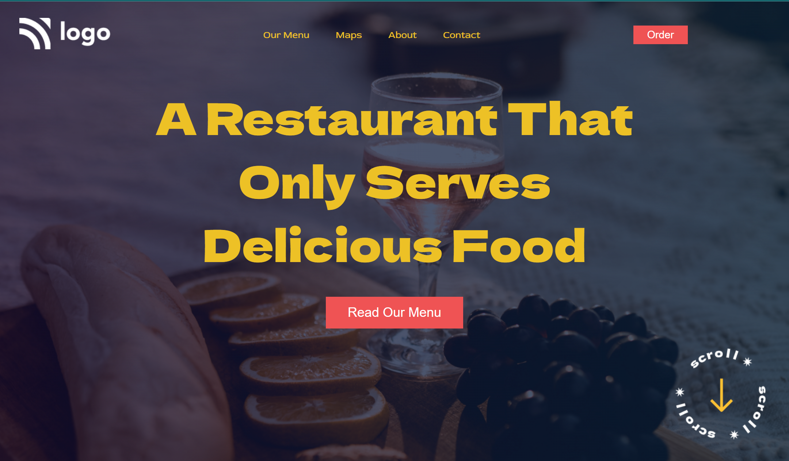

# Restaurant Landing Page

> ## [Prateek Budhiraja](https://prateekbudhiraja.in)

 

## Tech Stack:

---

### Checkout the live website [here](https://restaurant-landing-tau.vercel.app/).

---

## My Learnings

- Learned about positioning.
- Learned about how to apply gradiant on background image.

---

## How the website looks like

